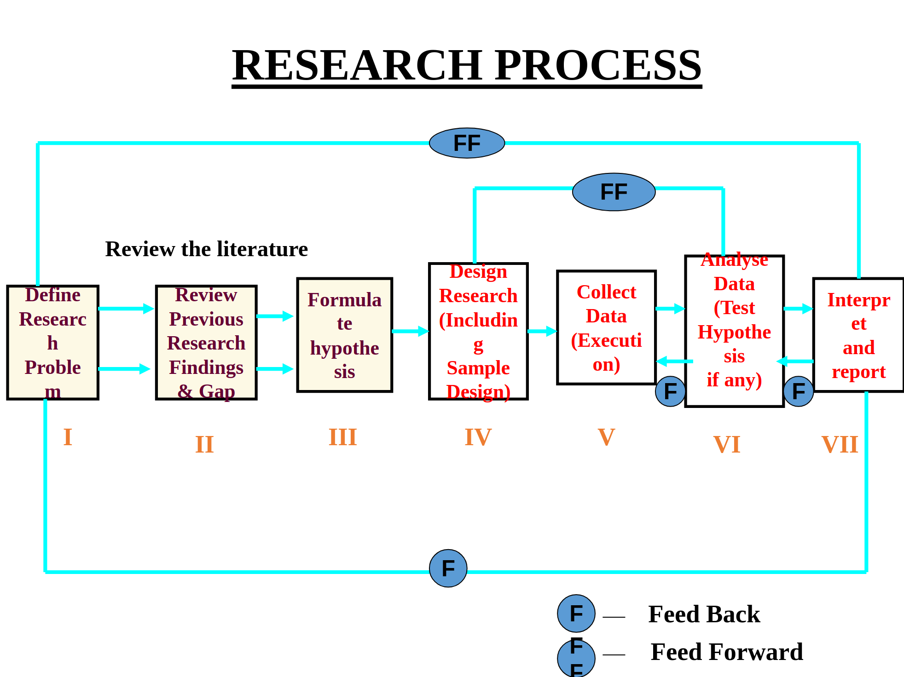

### What is Research

> "Research is a careful investigation or inquiry especially through search for new facts in any branch of knowledge."

> "Research is a systematic and objective investigation of a subject or problem in order to discover facts, establish or revice theories, and develop practical applications."

#### Purpose of Research

- To **understand** a phenomenon.
- To **test** a hypothesis.
- To **find solutions** to problems.
- To **contribute** to academic or practical knowledge.

#### Types of Research Methods

- **Basic Research**: Purely for theory-building or hypothesis generation.
- **Historical Research**: Used to understand past trends or theory development.
- **Descriptive Research**: Often used in applied settings like market research, education, healthcare.
- **Experimental Research**: Common in applied sciences for testing solutions.
- **Ethnographic Research**: Used in applied anthropology, marketing, education.
- **Qualitative Research**: Applied when studying user behavior, education, psychology.
- **Quantitative Research**: Frequently used in applied fields like economics, public health, etc.

##### Basic Research

- Also known as **fundamental research / pure research** is carried out to increase understanding of fundamentals principles.

- It is done for the sake of knowledge without any intention to apply it in practice.

Many times, the end results have no direct or immediate commercial benefits.
Basic research can be thought of as arising out of **curiosity**.

However, in the long term, it is the basis of many commercial products & **applied research**.

It is mainly carried out by universities.

##### Applied Research

- It is a form of systematic inquiry involving the practical application of science. It accesses and uses some part of the research community's accumulated theories, knowledge, methods, and techniques for a specific, often state-business, or client-driven, purpose.
- It is done to find solutions to a real life problem requiring an action or policy decision.

##### Descriptive Research Method

- Descriptive study is one in which information is collected without changing the environment (nothing is manipulated). It is used to obtain information concerning the current status of the phenomenon to describe "what exists" with respect to variables or conditions in a situation.

- Present trends, beliefs, public mind, their viewpoint and attitudes, their effects or development of new trends are described.

##### Uses of Descriptive Research

- To describe the characteristics of relevant groups, such as consumers, salespeople, organizations, or market areas.
- To estimate the percentage of units in a specifies population exhibiting a certain behavior.
- To determine the perceptions of products characteristics.
- To determine the degree to which marketing variables are associated.
- To make specific predictions

##### Ethnographic Research Method

Includes extended **fieldwork** in a particular cultural group.

**Fieldwork** features participant observation in which the researcher observes and participates in the daily life of the community being studies.

###### Nature of Ethnographic Research

- used in the study of human interactions in social settings.
- Highly descriptive, holistic approach to research.
- Topics must involve people in groups
- May last from a week to several years
- Excellent at constructing a very detailed picture of human life and interactions.

##### Experimental Research

It is an attempt by the researcher to maintain control over all factors that may affect the result of an experiment. In doing this, the researcher attempts to determine or predict what may occur.

##### Historical Research

- It is the systematic collection and evaluation of data to describe, explain, and understand actions or events that occurred sometime in the past.
- There is no manipulation or control of variables as in experimental research.
- It attempts to reconstruct what happened during a certain period of time as completely and accurately as possible.

##### Conceptual Research

It is related to abstract idea(s) or theory. Generally used by philosophers and thinkers to develop new concepts or to reinterpret existing ones.

##### Empirical Research

Relies on experience or observation alone, often without due regard for system and theory.

It is **data-based** research.

It involves coming up with conclusions which are capable of being verified by observation or experiment.

##### Difference between **Qualitative** and **Quantitative** Research

| Qualitative                                                          | Quantitative                                                              |
| -------------------------------------------------------------------- | ------------------------------------------------------------------------- |
| Explains attitudes and behaviors of the market in detail.            | ideal for discovering who, what, when and, where.                         |
| Generates verbal information to understand opinions and motivations. | Generates numerical data to get effective statistics.                     |
| It can be done with open questions, observaiton, focus group, etc.   | It's done through surveys or other data collections techniques.           |
| It can provide a deeper understanding of the object of study.        | Provides hard data and userful information for making business decisions. |

---

#### Research Process

##### Stage 1: Define Research Problem

- Clearly identify and define the research problem or question.

##### Stage 2: Review of Literature

- Study existing research, concepts, and finding relevant to the problem.

##### Stage 3: Formulate Hypothesis

- Develop hypothesis and assumptions to be tested.

##### Stage 4: Research Design

- Plan methodology, sampling, tools, and executions strategy.

##### Stage 5: Data Collection

- Execute the plan and gather necessary data.

##### Stage 6: Data Analysis

- Analyze data and test hypothesis if applicable.

##### Stage 7: Interpretation and Report

- Draw conclusions, interpret results, and prepare the final report.
